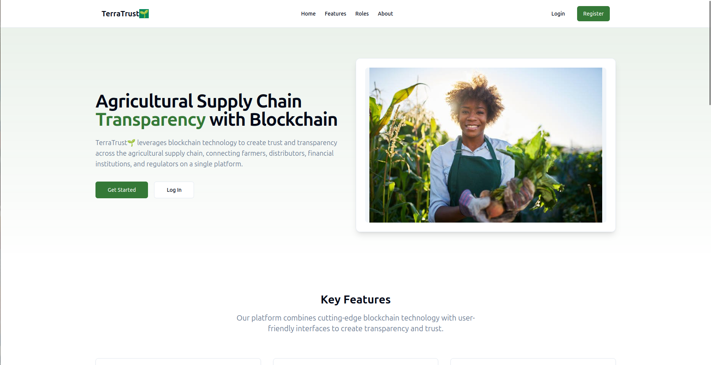
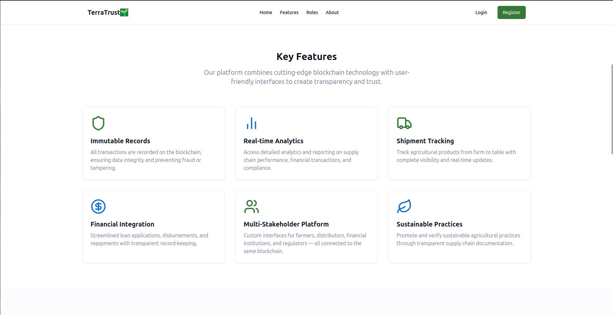
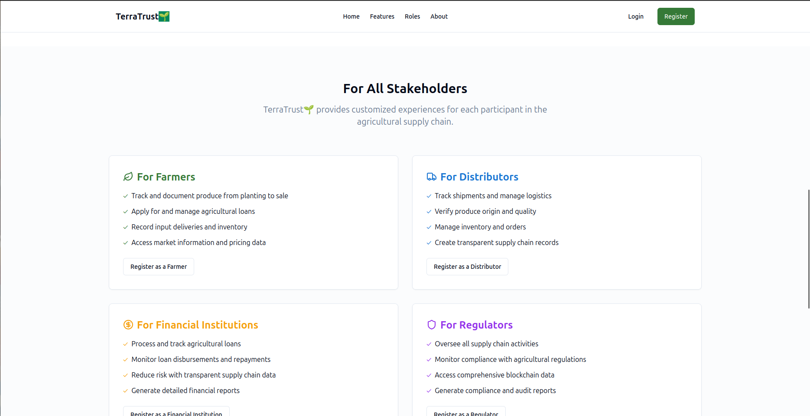
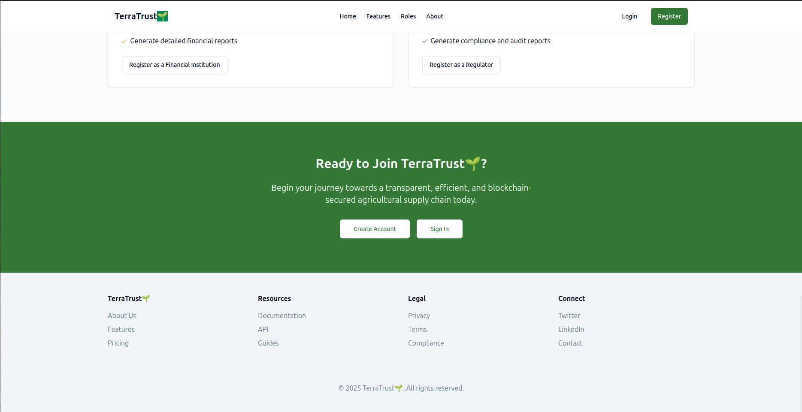
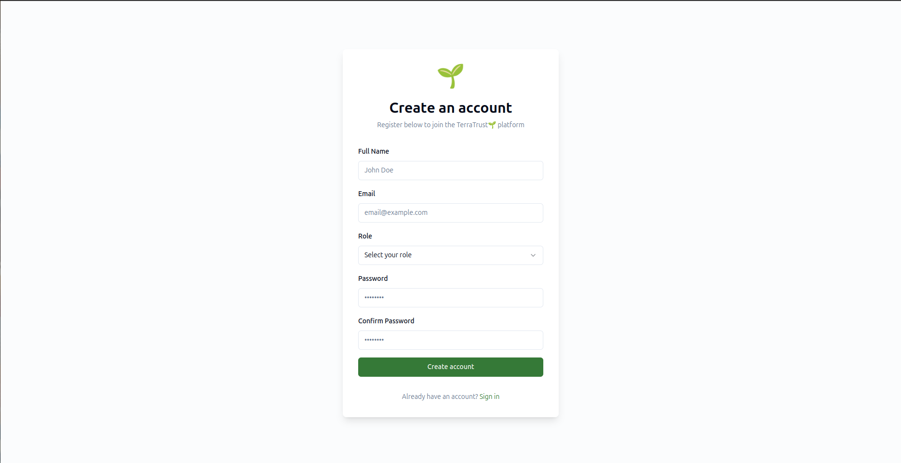
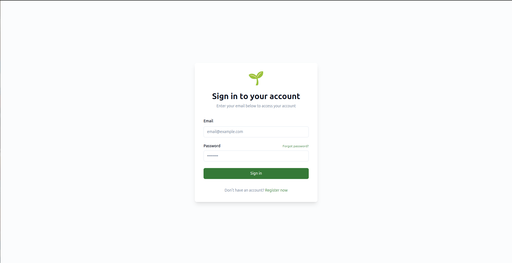
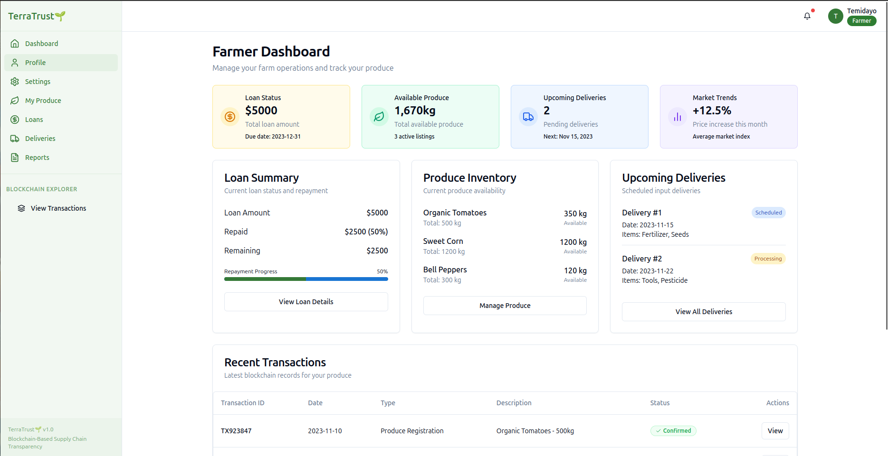

# TerraTrust  //still looking for a name to avoid copyright infrigment🌱

TerraTrust is an agri tech startup aimed at improving the supply chain system in Africa. TerraTrust main approach is of three key areas
- Helping farmers easily gain access to Credit loans from credit facilities
- Helping farmers to access to fARM inputs especially farmers in the rural regions 
- Helping farmers to distribute their farm produces from the farm to the market area

## Authors

- [Akanbi-Bello Temidayo](https://www.github.com/themydee)

## Appendix

Any additional information goes here

## Documentation

[Documentation](https://linktodocumentation)

## Color Reference

| Color           | Hex                                                                |
| -------------- | ------------------------------------------------------------------ |
| Primary Green  |  #4CAF50  |
| Dark Green     |  #2E7D32  |
| Primary Blue   |  #1976D2  |
| Teal Accent    |  #009688  |
| Dark Gray      |  #424242  |
| White          |  #FFFFFF  |

## Installation

Follow these steps to set up and run **TerraTrust🌱** on your local machine.

### **Prerequisites**
Before you begin, ensure you have the following installed:  
- [Node.js](https://nodejs.org/) (v16+ recommended)  
- [Git](https://git-scm.com/)  
- [MongoDB](https://www.mongodb.com/) (if using locally)  
- [MetaMask](https://me## Installation

Follow these steps to set up and run **TerraTrust🌱** on your local machine.

### **Prerequisites**
Before you begin, ensure you have the following installed:  
- [Node.js](https://nodejs.org/) (v16+ recommended)  
- [Git](https://git-scm.com/)  
- [MongoDB](https://www.mongodb.com/) (if using locally)  
- [MetaMask](https://metamask.io/) (for blockchain testing)  

### **1️⃣ Clone the Repository**
1️⃣ Clone the Repository

git clone https://github.com/themydee/TerraTrust.git
cd TerraTrust

2️⃣ Install Dependencies

npm install

For Yarn users, run:

yarn install

3️⃣ Set Up Environment Variables

Create a .env file in the project root and add:

PORT=5000,

MONGO_URI=mongodb+srv://your_db_url

JWT_SECRET=your_jwt_secret

4️⃣ Start the Development Server

npm run dev

For separate backend and frontend instances:

# Start backend
cd server

npm run dev

# Start frontend
cd client

npm start

5️⃣ Access the Application

Frontend: http://localhost:3000

Backend API: http://localhost:5000/api

7️⃣ Running Tests

npm test

8️⃣ Build for Production

npm run build

API Endpoints

Authentication

POST /auth/register – Register a new user

POST /auth/login – Login user & issue JWT

Farm Produce & Input Tracking

POST /produce/add – Log farm produce details

GET /produce/{id} – Get details of a specific farm produce

POST /input/track – Track farm input distribution

Loan Management

POST /loan/apply – Apply for a loan

GET /loan/status/{id} – Get loan status

POST /loan/release – Disburse loan via smart contract

Transaction History & Analytics

GET /transactions – Get all transactions

GET /dashboard/analytics – View supply chain insights

Deployment

Frontend: Deploy on Vercel or Netlify

Backend: Deploy on Vercel or AWS

Database: Use MongoDB Atlas for cloud hosting

Contributing

Contributions are welcome! To contribute:

Fork the repository

Create a new branch (git checkout -b feature-branch)

Commit your changes (git commit -m 'Add new feature')

Push to the branch (git push origin feature-branch)

Open a Pull Request

License

This project is licensed under the MIT License.

🚀 Let’s build the future of agritech together!

## Feedback

If you have any feedback, please reach out to us at nifetemiboy@gmail.com

## DEMO HERE

